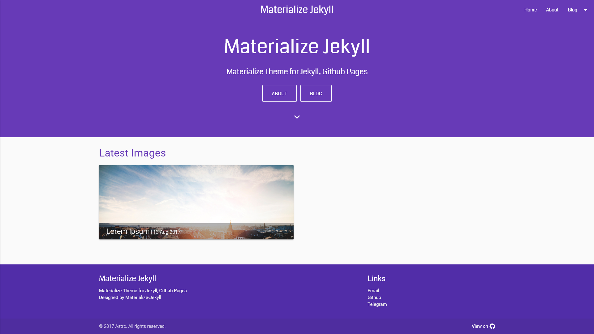
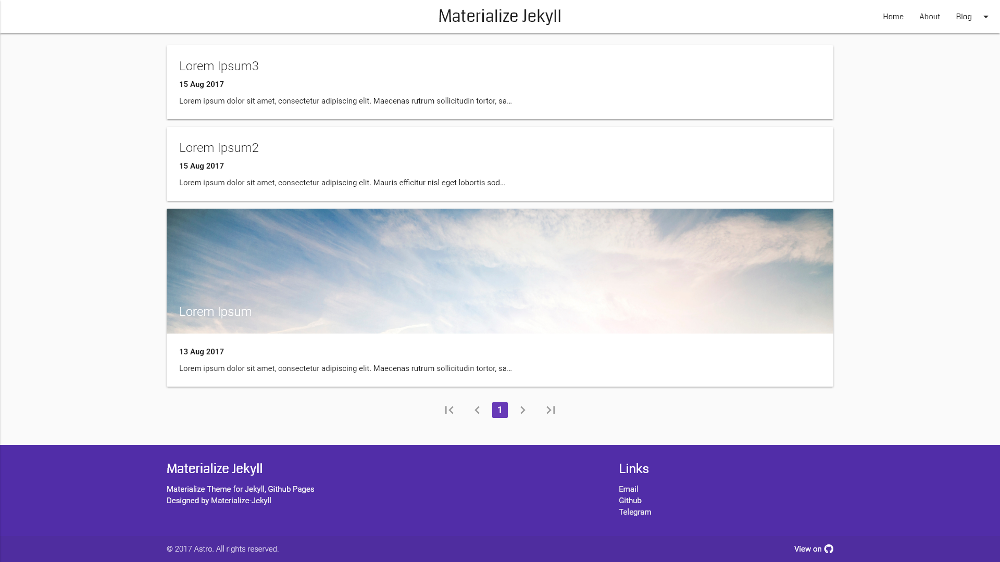
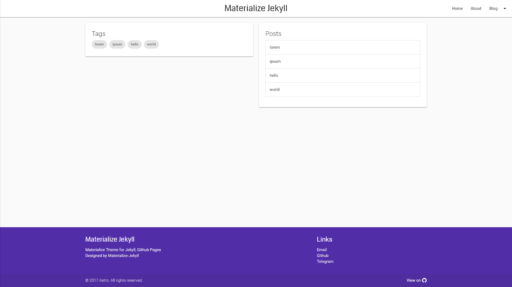
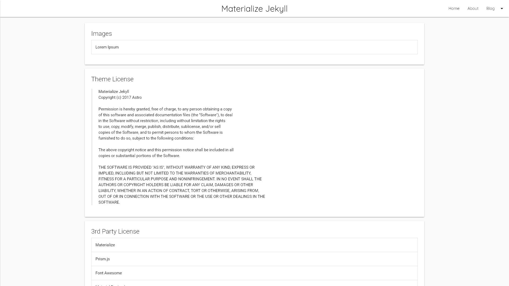

# Materialize-Jekyll


> Materialize Theme for Jekyll, Github Pages

## Demo

| Index | Posts |
|:-:|:-:|
|  |  |

| Tags | Resources |
|:-:|:-:|
|  |  |

See [example](http://astro36.me/Materialize-Jekyll/)

## License

```text
Materialize Jekyll
Copyright (c) 2017 Astro
```
